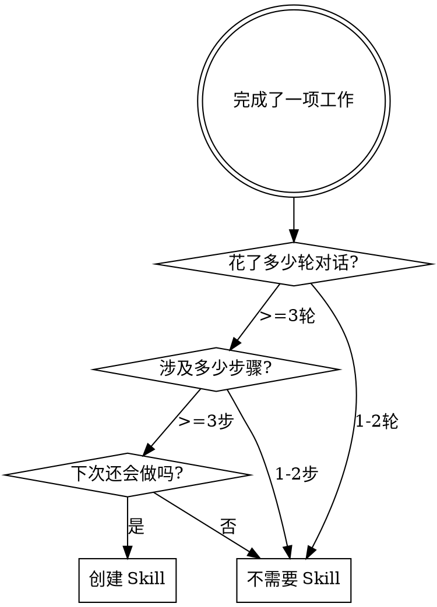

# Skill Lifecycle Engineering

## Overview

Skill 不是写完就结束的静态文档，而是需要持续迭代的 spec 工程。本方法论覆盖 skill 的完整生命周期：识别候选 → 变更管理 → 下游串联。

## Phase 1: Identification — 何时创建 Skill

**核心信号：** 如果一件事需要很多动作、聊了很多次才完成，它就是 skill 的候选。



**识别检查清单：**
- 多轮对话（>=3轮）才完成
- 涉及多个工具或步骤（>=3步）
- 未来会重复执行
- 过程中有非显而易见的判断或决策

### 自动检测（Hook 驱动）

已配置 hooks 自动监测 session 复杂度：

- **PostToolUse hook**（async, 0 token）— 每次工具调用递增计数器，纯 shell 无 Claude 参与
- **Stop hook** — session 结束时检查计数器，仅当 >=15 次工具调用时才注入 1 句提示

阈值可通过环境变量调整：`SKILL_CANDIDATE_THRESHOLD=20`

**Token 开销：** 低于阈值的 session = 0 额外 token。超过阈值 = ~30 token 的提示注入。

## Phase 2: Change Management — CHANGE.md 提案机制

当 skill 在使用过程中暴露问题或需要改进时，不要直接修改 SKILL.md，而是先在 CHANGE.md 中记录提案。

### CHANGE.md 格式

在对应 skill 目录下创建 `CHANGE.md`：

```markdown
# Change Proposals

## #001 - [提案标题]
- **Status:** proposed | accepted | rejected | implemented
- **Date:** 2026-04-30
- **Trigger:** 什么场景触发了这个修改需求
- **Proposal:** 具体要修改什么，为什么
- **Impact:** 修改后对现有流程的影响

## #002 - [提案标题]
...
```

### 提案状态流转

```
proposed → [用户 review] → accepted → implemented
                        → rejected (附原因)
```

**规则：**
- 编号从 #001 开始，递增不跳号
- 每个提案必须经过用户 review 才能进入 accepted
- implemented 后在 SKILL.md 中标注对应提案编号
- rejected 的提案保留记录，附拒绝原因

### 何时创建提案

- Skill 执行中发现步骤缺失或顺序有误
- 用户反馈某步骤多余或需要调整
- 发现新的边界条件未覆盖
- 下游 skill 对接时发现接口不匹配

## Phase 3: Composition — 下游 Skill 串联

Skill 执行完毕后，评估是否存在可串联的下游 skill。

**评估维度：**

| 问题 | 如果是 |
|------|--------|
| 当前 skill 的输出是否是另一个 skill 的输入？ | 建立串联关系 |
| 执行完后是否有固定的后续动作？ | 考虑在 SKILL.md 末尾添加 Next Step |
| 多个 skill 是否总是一起执行？ | 考虑创建编排 skill |

**串联方式：**

1. **显式推荐** — 在 SKILL.md 末尾添加：
   ```markdown
   ## Next Steps
   - 如果需要 X，使用 [skill-name]
   - 如果需要 Y，使用 [another-skill]
   ```

2. **编排 Skill** — 当多个 skill 固定组合时，创建一个新的编排 skill 定义执行顺序和数据传递。

## Quick Reference

| 阶段 | 触发条件 | 产物 |
|------|----------|------|
| Identification | 多轮、多步、可重复 | 新 SKILL.md |
| Change Management | 使用中发现问题 | CHANGE.md 提案 |
| Composition | 执行后有后续动作 | Next Steps / 编排 skill |

## Common Mistakes

- **直接改 SKILL.md 不留痕迹** — 用 CHANGE.md 追踪，保留决策历史
- **提案堆积不 review** — 定期清理，保持提案列表可管理
- **过度串联** — 只串联真正有数据依赖的 skill，不要为了串联而串联
- **忽略 rejected 提案** — rejected 的提案同样有参考价值，保留原因记录
